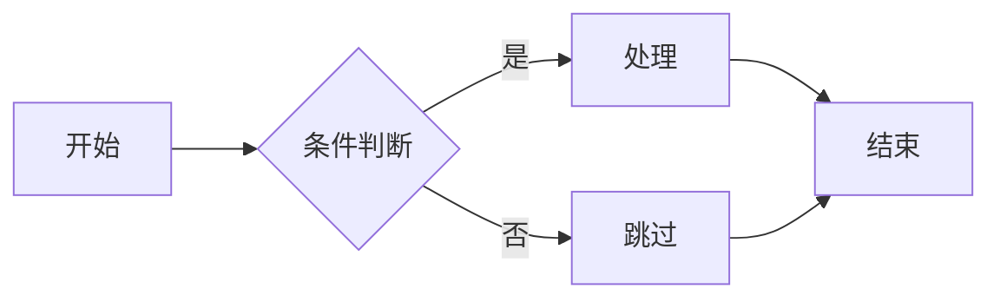
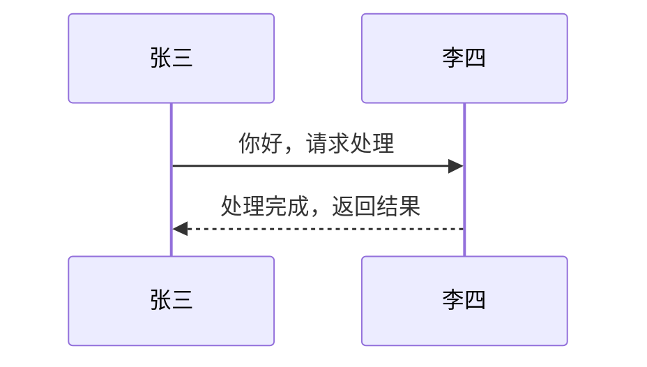
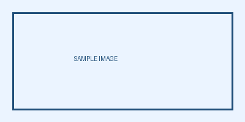

# 图表成文测试文档

## 流程图示例

这是一个简单的流程图，正文包含 **加粗文字**、`行内代码` 和 [链接](https://example.com)。



## 时序图示例



## 坏语法块（应报错且不产出图片）

下面这段 mermaid 有语法错误：

```mermaid
graph TD
    A[开始 --> B[结束
```

## 表格示例

| 环节 | 说明 |
|------|------|
| 渲染 | headless Chromium 截图 |
| 转档 | PIL 快速裁白边 |

## 新能力测试

- 一级列表项（带 [链接](https://example.com) 和 **加粗**）
  - 二级嵌套项
    - 三级嵌套项
- 回到一级

1. 第一步
2. 第二步
   - 二级说明项
3. 第三步

> 这是一条普通引用块，不应被过滤，应显示为灰色缩进文字。



正文行内链接测试：详情见 [官方文档](https://mermaid.js.org)，此链接语法应转为纯文字。
